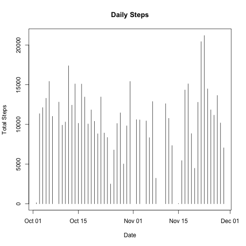
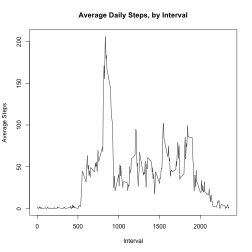
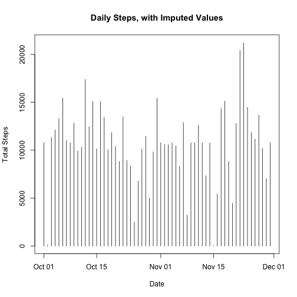
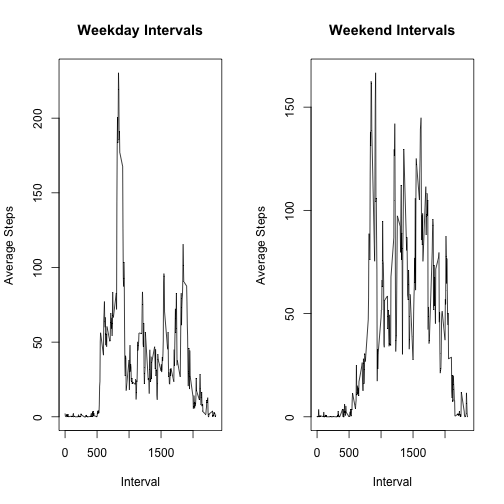

# Loading and preprocessing the data
1. Load the data

```r
data <- read.csv("activity.csv")
```

```
## Warning in file(file, "rt"): cannot open file 'activity.csv': No such file
## or directory
```

```
## Error in file(file, "rt"): cannot open the connection
```
2. Process/transform the data into a format suitable for your analysis

```r
data$date <- as.Date(data$date) ## convert dates to date type
data_clean <- data[!is.na(data$steps),] ## remove missing values
```

# What is the mean total number of steps taken per day?
1. Calculate the total number of steps taken per day.

```r
library(dplyr)
data_grouped <- group_by(data_clean, date)
daily_steps <- summarize(data_grouped, steps.total = sum(steps))
```
2. Make a histogram of the total number of steps taken each day.

```r
plot(daily_steps, type = "h", main = "Daily Steps", xlab = "Date", ylab = "Total Steps")
```

 

3. Calculate and report the mean and median of the total number of steps taken per day.

```r
mean(daily_steps$steps.total)
```

```
## [1] 10766.19
```

```r
median(daily_steps$steps.total)
```

```
## [1] 10765
```

# What is the average daily activity pattern?
1. Make a time series plot of the 5-minute interval (x-axis) and the average number of steps taken, averaged across all days (y-axis)

```r
data_grouped2 <- group_by(data_clean, interval)
interval_steps <- summarize(data_grouped2, steps.avg = mean(steps))
plot(interval_steps, type = "l", main = "Average Daily Steps, by Interval", xlab = "Interval", ylab = "Average Steps")
```

 

2. Which 5-minute interval, on average across all the days in the dataset, contains the maximum number of steps?

```r
interval_steps[interval_steps$steps.avg == max(interval_steps$steps.avg),]
```

```
## Source: local data frame [1 x 2]
## 
##   interval steps.avg
## 1      835  206.1698
```

# Imputing missing values
1. Calculate and report the total number of missing values in the dataset (i.e. the total number of rows with NAs).

```r
sum(is.na(data))
```

```
## [1] 2304
```
2/3. Devise a strategy for filling in all of the missing values in the dataset. The strategy does not need to be sophisticated. For example, you could use the mean/median for that day, or the mean for that 5-minute interval, etc. Create a new dataset that is equal to the original dataset but with the missing data filled in.

```r
## Replace NA values with interval averages
data_new <- data
for(i in 1:nrow(data_new)) {
      if(is.na(data_new[i,1]) == TRUE) {
            interval_i = data_new[i,3]
            data_new[i,1] <- as.numeric(subset(interval_steps, interval == interval_i)[2])
      }
}
```
4. Make a histogram of the total number of steps taken each day and Calculate and report the mean and median total number of steps taken per day. Do these values differ from the estimates from the first part of the assignment? What is the impact of imputing missing data on the estimates of the total daily number of steps?

```r
data_grouped3 <- group_by(data_new, date)
daily_steps2 <- summarize(data_grouped3, steps.total = sum(steps))
plot(daily_steps2, type = "h", main = "Daily Steps, with Imputed Values", ylab = "Total Steps", xlab = "Date")
```

 

```r
mean(daily_steps2$steps.total)
```

```
## [1] 10766.19
```

```r
median(daily_steps2$steps.total)
```

```
## [1] 10766.19
```
Here we can see that while the mean for the new dataset remains the same, the median has changed to be equal to the mean. This makes sense, because there are now more values exactly equal to the mean - thus, the overall mean will be unaffected, while the overall median will shift closer to (in this case exactly to) the overall mean.

# Are there differences in activity patterns between weekdays and weekends?
1. Create a new factor variable in the dataset with two levels – “weekday” and “weekend” - indicating whether a given date is a weekday or weekend day.

```r
data_new2 <- mutate(data_new, Day.Type = weekdays(data_new$date))
data_new2[data_new2$Day.Type != "Sunday" & data_new2$Day.Type != "Saturday",]$Day.Type <- 0
data_new2[data_new2$Day.Type == "Sunday" | data_new2$Day.Type == "Saturday",]$Day.Type <- 1
data_new2$Day.Type <- as.numeric(data_new2$Day.Type)
data_new2 <- mutate(data_new2, Day.Type = factor(data_new2$Day.Type, labels = c("weekday", "weekend")))
```
2. Make a panel plot containing a time series plot of the 5-minute interval (x-axis) and the average number of steps taken, averaged across all weekday days or weekend days (y-axis). See the README file in the GitHub repository to see an example of what this plot should look like using simulated data.

```r
data_weekday <- subset(data_new2, Day.Type == "weekday")
weekday_grouped <- group_by(data_weekday, interval)
weekday_ints <- summarize(weekday_grouped, int.avg = mean(steps))

data_weekend <- subset(data_new2, Day.Type == "weekend")
weekend_grouped <- group_by(data_weekend, interval)
weekend_ints <- summarize(weekend_grouped, int.avg = mean(steps))

par(mfrow = c(1,2))
plot(weekday_ints, type = "l", xlab = "Interval", ylab = "Average Steps", main = "Weekday Intervals")
plot(weekend_ints, type = "l", xlab = "Interval", ylab = "Average Steps", main = "Weekend Intervals")
mtext("Average Daily Steps, by Interval", outer = TRUE, cex = 1.25)
```

 

